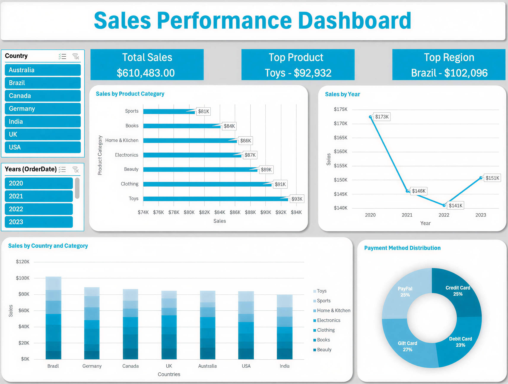
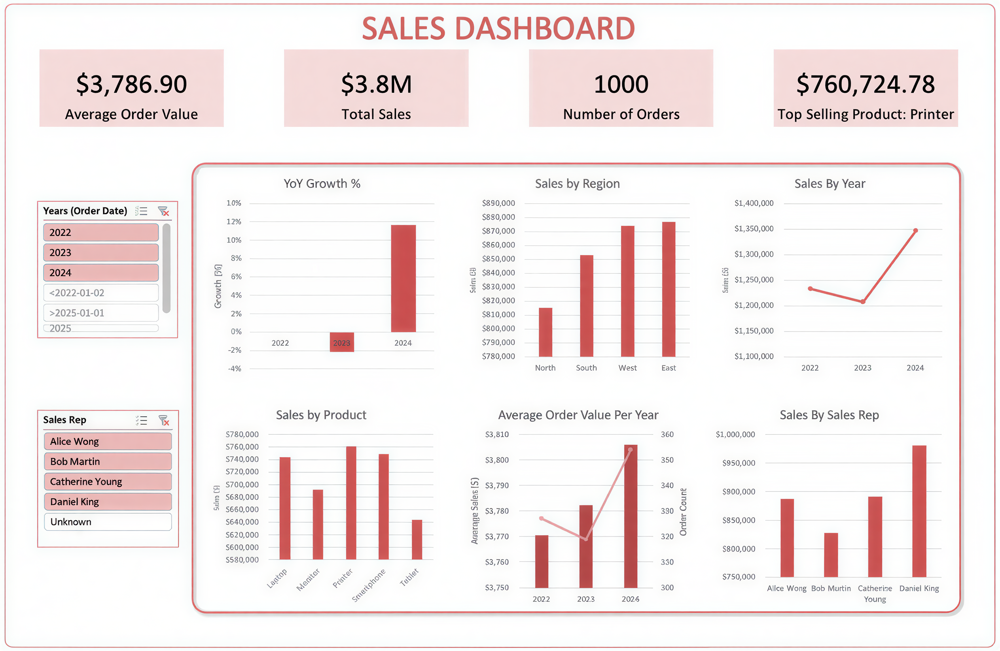
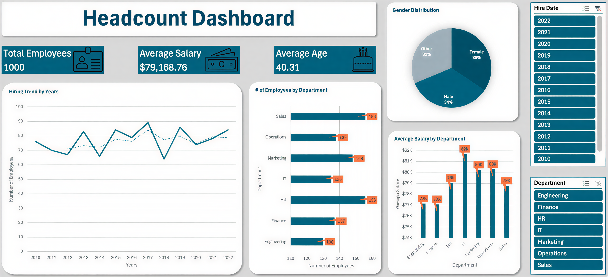

# Excel Dashboard Portfolio

Showcasing Excel dashboards I created to analyze sales and HR data. Using PivotTables, PivotCharts, Slicers, and advanced functions like GETPIVOTDATA and INDEX/MATCH, I turn raw data into actionable insights.

---

<strong>Sales Performance Dashboard</strong>

### Overview

Analyzes global sales performance across regions, products, and years.

### Dataset

- **Fields:** Country, Product Category, Year, Total Sales, Payment Method
- **Data:** Sample sales dataset (fictional)

### Key Features

- **KPIs:** Total Sales, Top Product, Top Region
- **Slicers:** Year, Country
- **Charts:**
  - Sales by Product Category (Bar Chart)
  - Sales Trend by Year (Line Chart)
  - Sales by Country & Category (Stacked Column Chart)
  - Payment Method Distribution (Pie Chart)

### Insights

- Brazil leads with $102K in sales
- Toys are the top product category at $92K
- Sales dipped in 2021–2022, rebounded in 2023
- Credit Card and Gift Card payments account for 52% of transactions

### Tools & Skills

**Excel:** PivotTables, PivotCharts, Slicers, GETPIVOTDATA, INDEX/MATCH

### Screenshot

---

<strong>Sales Dashboard</strong>

### Overview

Tracks overall sales performance, order value trends, and year-over-year growth.

### Dataset

- **Fields:** Order Date, Customer Name, Region, Product Quantity, Unit Price, Sales Rep, Notes, Total Sales
- **Data:** Sample sales dataset (fictional)

### Key Features

- **KPIs:** Average Order Value, Total Sales, Number of Orders, Top Selling Product
- **Slicers:** Year, Sales Rep
- **Charts:**
  - Year-over-Year Growth % (Bar Chart)
  - Sales by Region (Bar Chart)
  - Sales by Year (Line Chart)
  - Average Order Value per Year (Clustered Column + Line Chart)
  - Sales by Sales Rep (Bar Chart)

### Insights

- East Region leads with $870K in sales
- Daniel King tops Sales Reps at $981K
- Sales dipped in 2023, rebounded in 2024
- Printers are the best-selling product at $761K

### Tools & Skills

**Excel:** PivotTables, PivotCharts, Slicers, GETPIVOTDATA, INDEX/MATCH

### Screenshot

---

<strong>Headcount Dashboard</strong>

### Overview

Presents organizational employee data.

### Dataset

- **Fields:** Employee ID, Department, Name, Job Title, Gender, Age, Salary, Hire Date, Performance Rating
- **Data:** Sample HR dataset (fictional)

### Key Features

- **KPIs:** Total Employees, Average Salary, Average Age
- **Slicers:** Hire Date (Year), Department
- **Charts:**
  - Hiring Trend by Year (Line Chart)
  - Number of Employees by Department (Bar Chart)
  - Average Salary by Department (Bar Chart)
  - Gender Distribution (Pie Chart)

### Insights

- IT department has the highest average salary at $82K
- Sales and HR have the most employees at 156 each
- Hiring peaked in 2017 and declined afterward

### Tools & Skills

**Excel:** PivotTables, PivotCharts, Slicers, GETPIVOTDATA, INDEX/MATCH

### Screenshot

