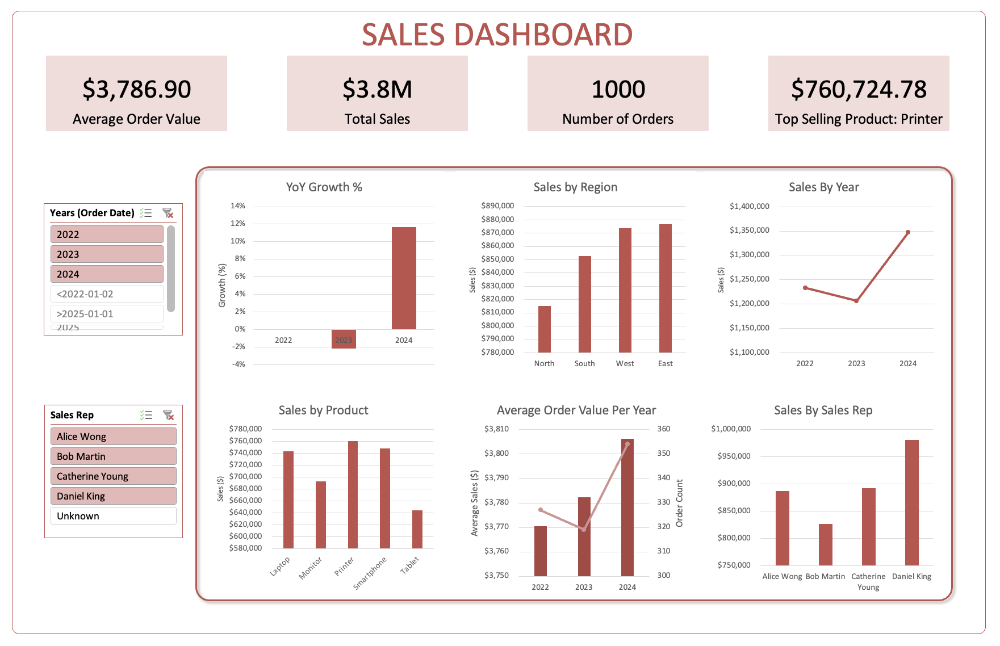

# Sales Performance Dashboard

## Overview

An Excel dashboard analyzing global sales performance across regions, products, and years.

## Dataset

- Fields: Country, Product Category, Year, Total Sales, Payment Method.
- Data: Sample sales dataset (fictional).

## Key Features

- KPIs:
  - Total Sales
  - Top Product
  - Top Region
- Interactive Slicers for Year and Country.
- Sales by Product Category (Bar Chart).
- Sales Trend by Year (Line Chart).
- Sales by Country & Category (Stacked Column).
- Payment Method Distribution (Pie Chart).

## Insights

- Brazil is the top-performing region with $102K sales.
- Toys are the leading product category ($92K).
- Sales dipped in 2021–2022 but recovered in 2023.
- Credit Card and Gift Card make up 52% of payments.

## Tools & Skills

- Excel: PivotTables, PivotCharts, Slicers, GETPIVOTDATA, INDEX/MATCH.

## Screenshot

# Sales Dashboard

## Overview

An Excel dashboard that tracks overall sales performance, order value trends, and year-over-year growth.

## Dataset

- Fields: Order Date, Customer Name, Region, Product Quantity, Unit Price, Sales Rep, Notes, Total Sales
- Data: Sample sales dataset (fictional).

## Key Features

- KPIs:
  - Average Order Value
  - Total Sales
  - Number of Orders
  - Top Selling Product
- Interactive Slicers for Years and Sales Rep
- YoY Growth % (Bar Chart)
- Sales by Region (Bar Chart)
- Sales by Year (Line Chart)
- Average Order Value Per Year (Clustered Column - Line)
- Sales by Sales Rep (Bar Chart)

## Insights

- East Region is the top-performing region with $870,724.12.
- Daniel King is the most successful Sales Rep with $980,842.42.
- Sales dipped in 2023 but recovered in 2024.
- Printers are the best-selling product with $760,724.78.

## Tools & Skills

- Excel: PivotTables, PivotCharts, Slicers, GETPIVOTDATA, INDEX/MATCH.

## Screenshot

# Headcount Dashboard

## Overview

An Excel dashboard that presents the organizational employee data.

## Dataset

- Fields: Employee ID, Department, Name, JobTitle, Gender, Age, Salary, HireDate, Performance Rating
- Data: Sample HR dataset (fictional).

## Key Features

- KPIs:
  - Total Employees
  - Average Salary
  - Average Age
- Interactive Slicers for HireDate (Year) and Department
- Hiring Trend by Years (line chart) ✔
- Number of Employees by Department (bar chart) ✔
- Average Salary by Department (bar chart) ✔
- Gender Distribution (pie chart)

## Insights

- IT department has the highest average salary at $82K.
- Sales and HR both have the highest number of employees at 156.
- Number of hires was the highest in 2017 and has gone down in the years since.

## Tools & Skills

- Excel: PivotTables, PivotCharts, Slicers, GETPIVOTDATA, INDEX/MATCH.

## Screenshot

